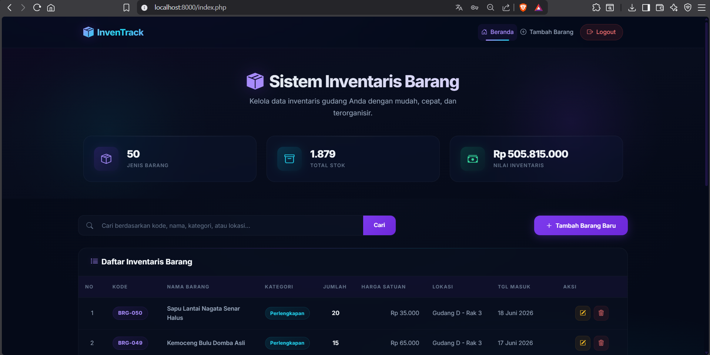
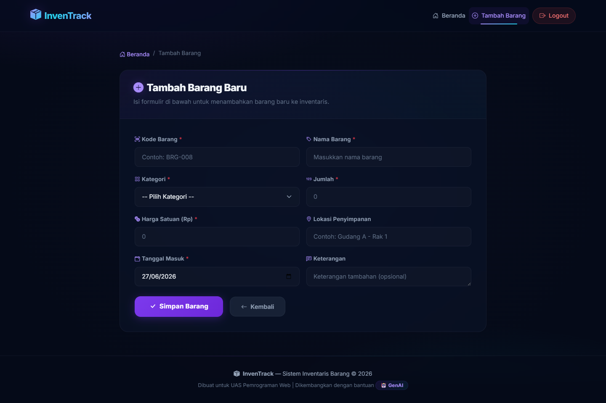
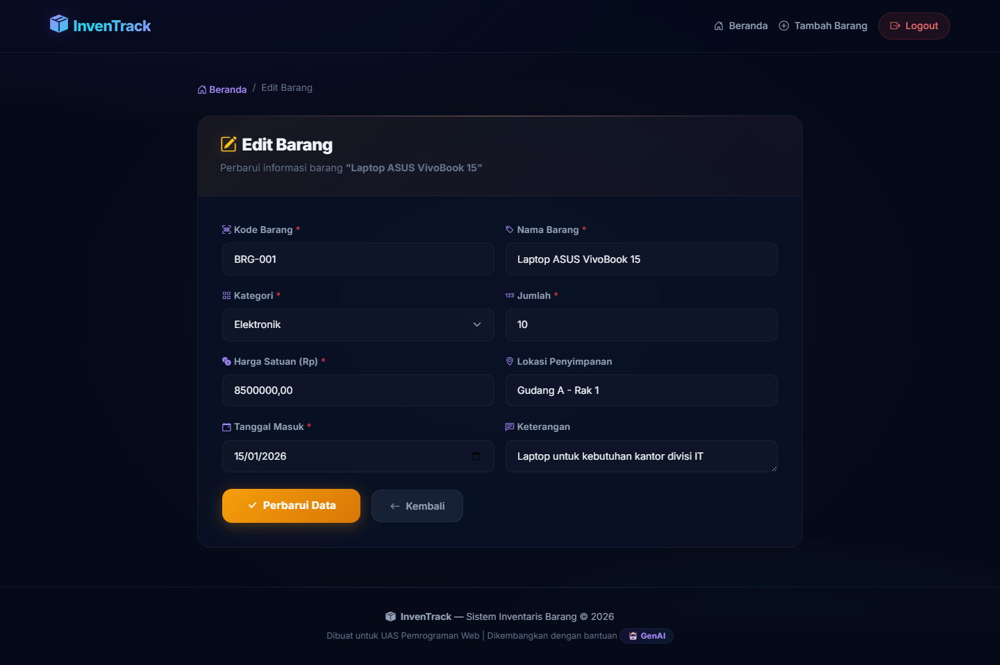

# 📦 InvenTrack - Sistem Inventaris Barang

> Aplikasi web CRUD sederhana untuk mengelola data inventaris barang gudang, dibuat menggunakan PHP Native dan MySQL.

---

## 👤 Informasi Pengembang

| Data | Keterangan |
|------|------------|
| **Nama** | [Sakirul Anam] |
| **NIM** | [220631100118] |
| **Mata Kuliah** | Pemrograman Web |
| **Tugas** | Ujian Akhir Semester (UAS) |

---

## 📋 Deskripsi Aplikasi

**InvenTrack** adalah sistem inventaris barang berbasis web yang memungkinkan pengguna untuk mengelola data inventaris gudang secara efisien. Aplikasi ini menyediakan fungsionalitas CRUD (Create, Read, Update, Delete) lengkap dengan antarmuka modern dan responsif.

### Fitur Utama:
- ✅ **Tambah Barang** — Menambahkan data barang baru ke inventaris
- ✅ **Lihat Daftar Barang** — Menampilkan seluruh data barang dalam tabel yang rapi
- ✅ **Edit Barang** — Mengubah/memperbarui informasi barang yang sudah ada
- ✅ **Hapus Barang** — Menghapus data barang dari inventaris
- ✅ **Pencarian** — Mencari barang berdasarkan kode, nama, kategori, atau lokasi
- ✅ **Dashboard Statistik** — Menampilkan ringkasan total jenis barang, stok, dan nilai inventaris
- ✅ **Indikator Stok Rendah** — Peringatan visual jika stok barang ≤ 5 unit
- ✅ **Validasi Input** — Pencegahan data kosong, duplikat kode, dan nilai negatif
- ✅ **Keamanan** — Perlindungan terhadap SQL Injection menggunakan `mysqli_real_escape_string`

---

## 📸 Screenshot Aplikasi







---

## 🗄️ Struktur Database

### Database: `db_inventaris`

### Tabel: `barang`

| Kolom | Tipe Data | Keterangan |
|-------|-----------|------------|
| `id` | INT(11) AUTO_INCREMENT | Primary Key |
| `kode_barang` | VARCHAR(20) | Kode unik barang (UNIQUE) |
| `nama_barang` | VARCHAR(100) | Nama barang |
| `kategori` | ENUM('Elektronik', 'Furniture', 'Alat Tulis', 'Perlengkapan', 'Lainnya') | Kategori barang |
| `jumlah` | INT(11) | Jumlah/stok barang |
| `harga` | DECIMAL(15,2) | Harga satuan dalam Rupiah |
| `lokasi` | VARCHAR(100) | Lokasi penyimpanan (opsional) |
| `tanggal_masuk` | DATE | Tanggal barang masuk |
| `keterangan` | TEXT | Keterangan tambahan (opsional) |
| `created_at` | TIMESTAMP | Waktu pembuatan data |
| `updated_at` | TIMESTAMP | Waktu terakhir update |

---

## 📁 Struktur File Proyek

```
UAS_PWEB/
├── css/
│   └── style.css           # File CSS Eksternal
├── img/                    # Folder untuk screenshot (opsional)
├── database.sql            # File ekspor database (SQL)
├── koneksi.php             # Koneksi ke database MySQL
├── index.php               # Beranda & Daftar Data Barang
├── tambah.php              # Form Tambah Data Barang
├── edit.php                # Form Edit Data Barang
├── hapus.php               # Proses Hapus Data Barang
└── README.md               # Dokumentasi proyek ini
```

---

## 🚀 Cara Menjalankan Aplikasi

### Prasyarat:
- **XAMPP** (atau WAMP/LAMP) sudah terinstal dengan Apache & MySQL aktif
- **Web Browser** (Chrome, Firefox, Edge, dll.)

### Langkah-langkah:

1. **Unduh/Clone proyek ini** ke dalam folder `htdocs` XAMPP:
   ```
   C:\xampp\htdocs\UAS_PWEB\
   ```

2. **Jalankan XAMPP**, kemudian **Start** modul **Apache** dan **MySQL**.

3. **Import Database:**
   - Buka browser dan akses **phpMyAdmin**: [http://localhost/phpmyadmin](http://localhost/phpmyadmin)
   - Klik tab **"Import"**
   - Klik **"Choose File"** / **"Pilih File"**, lalu pilih file `database.sql` dari folder proyek
   - Klik tombol **"Go"** / **"Kirim"** untuk mengeksekusi file SQL
   - Database `db_inventaris` beserta tabel `barang` dan data awalnya akan otomatis terbuat

4. **Akses Aplikasi:**
   - Buka browser dan ketik: [http://localhost/UAS_PWEB/](http://localhost/UAS_PWEB/)
   - Aplikasi siap digunakan! 🎉

---

## 🛠️ Teknologi yang Digunakan

| Teknologi | Versi / Detail |
|-----------|----------------|
| **HTML5** | Struktur halaman web |
| **CSS3** | Styling eksternal (`css/style.css`) |
| **Bootstrap 5** | Framework CSS via CDN |
| **Bootstrap Icons** | Ikon via CDN |
| **Google Fonts** | Font Inter |
| **PHP Native** | Logika backend & CRUD |
| **MySQL** | Database relasional |
| **mysqli** | Ekstensi PHP untuk koneksi MySQL |

---

## 📝 Konsep PHP yang Diimplementasikan

| Konsep | Implementasi |
|--------|-------------|
| **Variabel** | Digunakan di semua file PHP |
| **Percabangan (if/else)** | Validasi form, cek koneksi, kategori badge |
| **Perulangan (while/for)** | Menampilkan data tabel, opsi select kategori |
| **Fungsi buatan sendiri** | `formatRupiah()`, `formatTanggal()`, `sanitasi()` |
| **Include / Require** | `require 'koneksi.php'` dan `include 'koneksi.php'` |
| **Metode GET** | Pencarian data, hapus data (via URL parameter) |
| **Metode POST** | Tambah & edit data (via form submission) |
| **CRUD** | Create, Read, Update, Delete |

---

## ⚠️ Catatan

> **Proyek ini dikembangkan dengan bantuan Perangkat Kecerdasan Artifisial (GenAI).**

---

*© 2026 — UAS Pemrograman Web*
